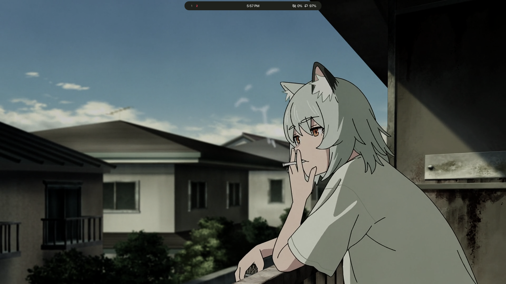

# <p align="center"> NixOS Flake ❄️ </p>

<p align="center">
    
</p>

**`Flatpaks`**

1. Add Flathub Remote
```
flatpak remote-add --if-not-exists flathub https://dl.flathub.org/repo/flathub.flatpakrepo
```
2. My Flatpaks
```
flatpak install flathub app.zen_browser.zen io.gitlab.librewolf-community org.libreoffice.LibreOffice com.discordapp.Discord org.gimp.GIMP com.github.jeromerobert.pdfarranger -y
```
